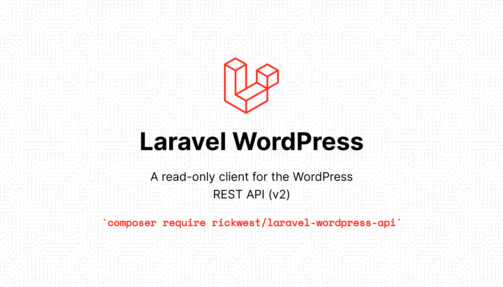

[](https://packagist.org/packages/rickwest/laravel-wordpress-api)
[](https://github.com/rickwest/laravel-wordpress-api/actions?query=workflow%3Arun-tests+branch%3Amain)
[](https://github.com/rickwest/laravel-wordpress-api/actions?query=workflow%3A"Check+%26+fix+styling"+branch%3Amain)
[](https://packagist.org/packages/rickwest/laravel-wordpress-api)

An unambitious read-only client for the WordPress REST API (v2). This package is the by-product of a side project, having found that I wanted a more expressive, fluent, Laravel-esque way of querying the WordPress API.

```php
// Without the package 👎
Http::get('https://example.com/wp-json/wp/v2/posts', [
    'search' => 'potatoes',
    '_embed' => 1,
    'orderby' => 'date',
    'order' => 'desc'
    '_fields' => 'title',
]);


// Using the package 👌
Wordpress::posts()
    ->search('potatoes')
    ->embed()
    ->latest()
    ->get('title');
```

As well as the fluent query builder, you also benefit from a nicely formatted response, including pagination information.

```php
// Without the package 👎
$response = Http::get('https://example.com/wp-json/wp/v2/posts');
$data = $response->json();
$pages = $response->header('X-WP-TotalPages');
$total = $response->header('X-WP-Total');


// Using the package 👌
$posts = Wordpress::posts()->get();

// $posts
[
    'data' => [...],
    'meta' => [
        'pages' => 1,
        'total' => 10,
    ],
],

```

## Installation

You can install the package via composer:

```bash
composer require rickwest/laravel-wordpress-api
```

Then you need to add your WordPress url to your `.env` file:

```dotenv
WORDPRESS_URL=https://example.com
```

## Usage

This package binds a singleton to the Laravel service container, so you can easily resolve the WordPress client directly from the container, or via dependency injection. 
Alternatively, the package also exposes both a Facade and a helper function should you prefer a shorter more expressive option.

Currently, the package has support for the following WordPress resources: *categories, comments, media, pages, posts, users*. 
Adding support for further resources is really easy, but these are the only ones that I need for now! For a list of all available resources please see https://developer.wordpress.org/rest-api/reference. I'm happy to accept PR's for any additions.

```php
// Resolve service directly from container and access the Posts API
app(Wordpress::class)->posts();

// Resolve via Facade and access the Posts API
Wordpress::posts(); 

// Resolve service via helper and access the Posts API
wordpress()->posts();

// Supported resources
Wordpress::categories(); // Access the Categories API
Wordpress::comments(); // Access the Comments API
Wordpress::media(); // Access the Media API
Wordpress::pages(); // Access the Pages API
Wordpress::posts(); // Access the Posts API
Wordpress::users(); // Access the Users API

// You can also access resources as properties
wordpress()->posts
```

 ### Retrieve a single resource

Call the `find` method on a resource class in order to get a single resource by ID:

```php
Wordpress::posts()->find(1);

// All WordPress resources share a handful of global parameters. https://developer.wordpress.org/rest-api/using-the-rest-api/global-parameters/ 
// You can use the relevant fluent builder methods to add these to your query
Wordpress::posts()->embed()->fields('title')->find(1);

// Some resources also accept a limited number of resource specific parameters. These can be passed as a second argument to the find method
Wordpress::posts()->find(1, ['password' => 'pa55w0rd']);
```

### Retrieve a collection of resources

Call the `get` method on a resource to retrieve a collection of resources. The response you receive can be controlled and filtered using various parameters, https://developer.wordpress.org/rest-api/reference/.
This package provides some fluent builder methods in order to easily and expressively build your desired query. Collection responses are then nicely formatted and include useful pagination information. 

```php
Wordpress::posts()->get();

// All WordPress resources share a handful of global parameters, https://developer.wordpress.org/rest-api/using-the-rest-api/global-parameters/,
// along with a number of filtering, ordering and pagination options. You can use the relevant fluent builder methods to build your query.
Wordpress::posts()
    ->embed(array|string $relations) // Embed linked resources into response. Reduces need for extra HTTP requests for related resources
    ->fields(array|string $fields) // Specify a subset fields to return in a response
    ->with(array|string $fields) // Alias for fields method above
    ->page(int $page) // Current page of the collection
    ->perPage(int $perPage) // Maximum number of items to be returned in result set
    ->search(string $term) // Limit results to those matching a string
    ->offset(int $offset) // Offset the result set by a specific number of items
    ->exlclude(int|array $ids) // Ensure result set excludes specific IDs
    ->inlude(int|array $ids) // Limit result set to specific IDs
    ->orderBy(string $field, string $direction) // Sort collection by object attribute, either ascending or descending
    
    // Resources with authors  
    ->author() // Limit result set to resources assigned to specific authors
    ->authorExclude() // Ensure result set excludes resources assigned to specific authors
    
    // Resources with dates
    ->after(Carbon $after) // Limit response to resources published after a given ISO8601 compliant date
    ->before(Carbon $before) // Limit response to resources published before a given ISO8601 compliant date
    ->latest() // Order by date, descending
    ->olders() // Order by date, ascending
    
    // Resources with slugs
    ->slug(string $slug)
    
    // When a utility doesn't exist for the parameter
    ->parameter(string $key, mixed $value) // Add a custom parameter to the query
    
    // Send it!        
    ->get();

// Conditionally adding parameters
Wordpress::posts()
    ->when($onlyIncludeTitle, function($query) {
        $query->fields('title');
    })
    ->get();
```

### Creating, updating and deleting resources

Whilst this package is primarily intended for reading data from the WordPress API, it is possible to perform write operations using the `send` method on a resource class.

```php
Wordpress::posts()->send(string $method, int $id, array $options);

// For example, updating a post might look like...
Wordpress::posts()->send('POST', 1, [
    'json' => ['title' => 'My New Title'],
]);

```

## Testing

```bash
composer test
```

## Changelog

Please see [CHANGELOG](CHANGELOG.md) for more information on what has changed recently.

## Contributing

Please see [CONTRIBUTING](https://github.com/rickwest/.github/blob/main/CONTRIBUTING.md) for details.

## Security Vulnerabilities

Please review [our security policy](../../security/policy) on how to report security vulnerabilities.

## Credits

- [Rick West](https://github.com/rickwest)
- [All Contributors](../../contributors)

## License

The MIT License (MIT). Please see [License File](LICENSE.md) for more information.
